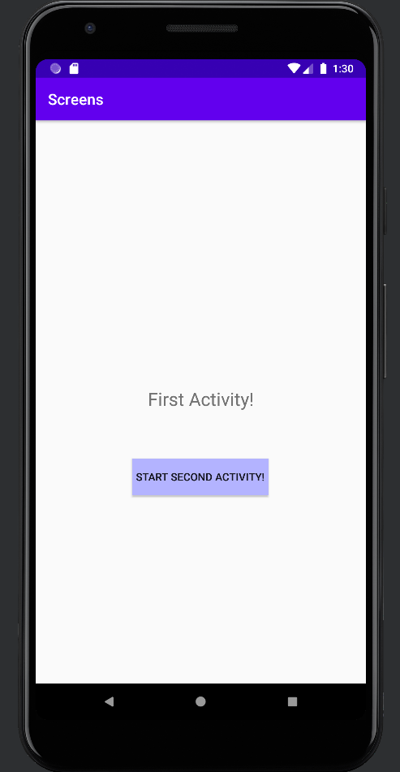
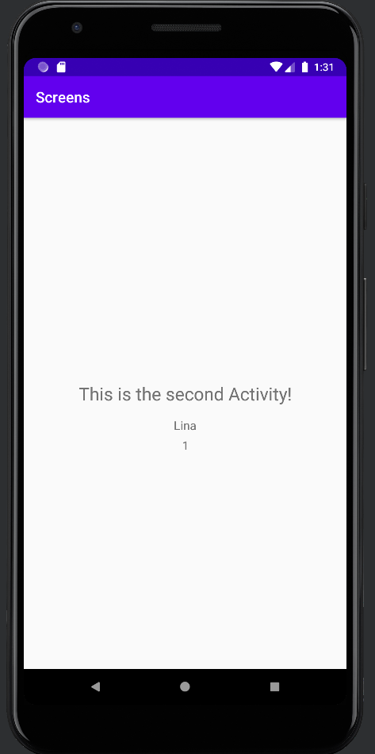

Programmering av mobila applikationer - Rapport "Activities & Intents"

Vi börjar med att lägga till ytterligare en Activity. Detta görs genom File > New > Activity > Empty Activity, vilket innebär att vår nya Activity läggs till 
automatiskt i manifestet (AndroidManifest.xml).

Tillägg i ManifestAndroid.xml för vår nya Activity som lagts till automatiskt:
Ytterligare en activity-tagg läggs till. Vi döper vår nya activity genom attributet "android:name" och sätter värdet till "SecondActivity". Eftersom appen inte
för denna inlämning behöver ha kontakt med andra appar så sätter vi attributet "android:exported" till "false". Andra appar har nu alltså inte tillgång till vår app för 
att exempelvis kunna starta någon av våra komponenter. 

```
...
<manifest xmlns:android="http://schemas.android.com/apk/res/android"
    ...
<application
        ...
        <activity
            android:name=".SecondActivity"
            android:exported="false" />
    </application>
...

```

När vi lägger till en ny Activity måste vi också se till att den har en fungerande layout. App -> Resources -> Layout -> Activity_Second.xml, här har vår nya Activity
fått en ConstraintLayout (default) där bredd och höjd matchar dess förälder.

```

<?xml version="1.0" encoding="utf-8"?>
<androidx.constraintlayout.widget.ConstraintLayout
    xmlns:android="http://schemas.android.com/apk/res/android"
    xmlns:tools="http://schemas.android.com/tools"
    xmlns:app="http://schemas.android.com/apk/res-auto"
    android:layout_width="match_parent"
    android:layout_height="match_parent"
    tools:context=".SecondActivity">

</androidx.constraintlayout.widget.ConstraintLayout>

```

I vår Activity_Main, d.v.s. vår layout för vår första Activity (MainActivity) lägger vi till en knapp. App -> Resources -> Layout -> Activity_Main.xml.
Först sätter vi ett ID på vår knapp för att vid behov kunna referera till den. Detta hanteras genom "android:id" och värdet sätts till det "My_Button".
Sedan ändrar sätter vi bredden på knappen, detta hanteras genom attributet "android:layout_width" och värdet sätts till "wrap_content". Detta innebär 
att objektet enbart kommer att ta upp såpass mycket plats som den behöver, till skillnad från "match_parent" som tar upp lika stor bredd som föräldern gör. 
Knappens höjd justeras genom attributet "android:layout_height" och värdet sätts även här till "wrap_content", här gäller samma princip som ovan nämnt.
Bakgrundsfärgen på objektet hanteras genom "android:background". Värdet anges i form av hexfärgkod. Knappen får här en blålila ton.
Då vi inte vill ha någon hårdkodad text så sätter vi attirbutet "android:text" och sätter värdet till "@string/start_second_activity". Detta innebär att 
programmet kommer att hämta den text som finns angiven för strängen med namnet "start_second_activity" i App -> Resources -> Values -> Strings.xml.
Sedan följer constraints för vårt objekt, det vill säga hur objektet ska förhålla i vår layout, till exempelvis andra objekt.

Här passade jag även på att lägga till en TextView till som gör det enklare att se att vi är på vår första Activity. Den är extremt grundläggande och 
fungerar efter samma principoer som vår knapp. Bortsätt från att knappen har en bakgrundsfärg och vår TextView har en skalbar text. 

```

<Button
        android:id="@+id/My_Button"
        android:layout_width="wrap_content"
        android:layout_height="wrap_content"
        android:background="#b3b3ff"
        android:text="@string/start_second_activity"
        app:layout_constraintBottom_toTopOf="@+id/textView"
        app:layout_constraintEnd_toEndOf="parent"
        app:layout_constraintHorizontal_bias="0.5"
        app:layout_constraintStart_toStartOf="parent"
        app:layout_constraintTop_toTopOf="parent"
        app:layout_constraintVertical_bias="0.5" />

<TextView
        android:id="@+id/textView"
        android:layout_width="wrap_content"
        android:layout_height="wrap_content"
        android:text="@string/first_activity"
        android:textSize="24sp"
        app:layout_constraintBottom_toBottomOf="parent"
        app:layout_constraintEnd_toEndOf="parent"
        app:layout_constraintHorizontal_bias="0.5"
        app:layout_constraintStart_toStartOf="parent"
        app:layout_constraintTop_toTopOf="parent"
        app:layout_constraintVertical_bias="0.494" />

```

App -> Resources -> Values -> Strings.xml. Härfirån kommer vår knapp att hämta den text som kommer att stå på knappen, som beskrivits ovan.

```

<resources>
    <string name="app_name">Screens</string>
    <string name="start_second_activity">Start second activity!</string>
</resources>

```

Jag kommer bara luftigt att beskriva vad som sker här efterom jag i föregående inlömning förklarat mer ingående hur en ClickListener fungerar och för risk för upprepning 
så gör jag här en lättare förklaring.
App -> Java -> MainActivity. För att knappen ska fungera behöver vi som vanligt importera några klasser. Därför importerar vi klasserna Button, View och Log. 
För att komma åt vår knapp och kunna beskriva vad knappen ska göra när den klickas på behöver vi referera till vår knapp. Detta gör genom "findViewById" metoden.  

Nu när vår knapp har refererats till, alltså kopplats, kan vi införa en ClickListener. En clicklistener är som bekant en funktion som lyssnar efter klick och bestämmer sedan 
vad som ska ske när ett klick uppfattas. Vi fäster en clicklistener till vår "b" knapp genom "b.setOnClickListener(new View.OnClickListener()". Om ett klick uppfattas kommer 
LogCat att visa att vi har klickat på knappen "My_Button".

```

import androidx.appcompat.app.AppCompatActivity;

...
import android.util.Log;
import android.view.View;
import android.widget.Button;

public class MainActivity extends AppCompatActivity {

    @Override
    protected void onCreate(Bundle savedInstanceState) {
        super.onCreate(savedInstanceState);
        setContentView(R.layout.activity_main);

        Button b = findViewById(R.id.My_Button);

        b.setOnClickListener(new View.OnClickListener() {
            @Override
            public void onClick(View view) {
                Log.d("==>","We clicked on My_Button!");
            }
        });
        
```

Nu ska vi beskriva exakt VAD som ska hända när vi klickar på knappen. Först måste vi importera ytterligare en klass, "Intent". Därefter anger vi 
kodsnutten: "Intent intent = new Intent(MainActivity.this, SecondActivity.class);". Klassen Intent används för att kunna starta en ny Activity.
Vi anger sedan variabeln "intent". I denna variabel lagrar vi sedan att vi vill starta en ny aktivitet genom "new Intent". Innanför paranteserna beskrivs enkelt uttryckt
vilken aktivitet som är aktiv och vilken aktivitet vi nu vill starta. "startActivity(intent)" innebär att vi vill starta en aktivitet. Inom parantesen står vår variabel
"intent", där vi lagrat vilken aktivitet som nu är aktiv och vilken aktivitet vi nu vill starta.


```

import androidx.appcompat.app.AppCompatActivity;

import android.content.Intent;
...

...
protected void onCreate(Bundle savedInstanceState) {
    b.setOnClickListener(new View.OnClickListener() {
        @Override
        public void onClick(View view) {

               Intent intent = new Intent(MainActivity.this, SecondActivity.class);
               startActivity(intent);
               Log.d("==>","We clicked on My_Button!");
        }
    });
...

```

För att enkelt kunna se att vi genom ett knapptryck på vår knapp startat en ny aktivitet har jag i layouten för Activity_Second (som ju är vår layout för vår SecondActivity)
lagt in en TextView. App -> Resources -> Layout -> Activity_Second.xml. TextViewen har specifikationer för bredd, höjd, constraints och en text som visas. Text är som vanligt inte hårdkodad utan hämtas från 
App -> Resources -> Values -> Strings.xml, från strängen som heter "this_is_the_second_activity".

```

<TextView
android:layout_width="wrap_content"
android:layout_height="wrap_content"
android:text="@string/this_is_the_second_activity"
app:layout_constraintBottom_toBottomOf="parent"
app:layout_constraintEnd_toEndOf="parent"
app:layout_constraintHorizontal_bias="0.5"
app:layout_constraintStart_toStartOf="parent"
app:layout_constraintTop_toTopOf="parent"
app:layout_constraintVertical_bias="0.5" />

</androidx.constraintlayout.widget.ConstraintLayout>

```

App -> Resources -> Values -> Strings.xml. Härfirån kommer vår TextView att hämta den text som kommer visas, som beskrivits ovan.

```

<resources>
    <string name="app_name">Screens</string>
    <string name="start_second_activity">Start second activity!</string>
    <string name="this_is_the_second_activity">This is the second Activity!</string>
</resources>

```
Nu ska vi lägga till den data som ska bifogas till vår SecondActivity. Detta görs i App -> Java -> MainActivity och hanteras genom att använda attributet "Extra".
"intent.putExtra("name", "Lina")", "Intent" står som ovan beskrivet för vår variabel där vi lagrat vilken aktivitvet som ska startas. "putExtra" kan beskrivas
som ett fält där datan som ska bifogas anges innanför parantesen. Till variabelns "intent" lägger vi nu alltså till några parametrar, bifogad data.
("name", "Lina"), där "name" kommer att fungera som en variabel där datan "Lina" lagras i. Detsamma gäller för "number" med datan "1".

```

public void onClick(View view) {

                Intent intent = new Intent(MainActivity.this, SecondActivity.class);
                intent.putExtra("name", "Lina");
                intent.putExtra("number", 1);
                startActivity(intent);
                Log.d("==>","We clicked on My_Button!");
            }

```

Nu är allt klart för att kunna skicka data från en Activity till en annan. Det som behöver göras nu är att skapa förutsättningar för vår SecondActivity att
kunna ta emot den bifogade datan. Detta hanteras i App -> Java -> SecondActivity. "Bundle extras = getIntent().getExtras()", bundle är en klass som används
för att skicka data från en Activity till en annan. Därefter följer en variabel som vi döper till "extras". I denna variabel lagrar vi två funktioner/metoder:
"getIntent()" och "getExtras()". Dessa innebär att vi vill hämta en Intent (en Activity) eller hämta Extras (bifogad data). Efter detta följer en if-sats,
"if (extras != null)" denna säger att om varibalen "extras" INTE motsvarar "null", d.v.s. att det finns data eller aktiviteter att hämta, så ska programmet 
hämta den data som variabeln "name" inehåller, d.v.s. värdet "Lina". Samma princip gäller för "int number = extras.getInt("number")", fast här hämtar vi en Integer
(Int) d.v.s. ett nummeriskt värde istället för en String (ett värde i tecken). 

```
...

protected void onCreate(Bundle savedInstanceState) {
        super.onCreate(savedInstanceState);
        setContentView(R.layout.activity_second);

        Bundle extras = getIntent().getExtras();
        if (extras != null) {
            String name = extras.getString("name");
            int number = extras.getInt("number");
        }

    }
...

```

Nu återstår att på lägga till en widget där vår bifogade data kan visas. Därför skapar jag två TextViews som ska visa vår data. Dessa TextViews fungerar enligt de
tidigare TextViews som visats i inlämingarna och jag går därför inte närmare in på exakt beskrivning. De innheåller kortfattat ett ID, bredd, höjd, marginaler,
textstorlek (skalbar), text som ska visas i vår TextView samt constraints för hur de ska förhålla sig till andra objekt eller liknande. Det enda som är viktigt att
lägga märke till här är att jag satt ID:et "name" på den ena och ID:et "number" på den andra.

```

<TextView
android:id="@+id/set_name"
android:layout_width="wrap_content"
android:layout_height="wrap_content"
android:layout_marginTop="15dp"
android:textSize="16sp"
android:text="@string/name"
app:layout_constraintBottom_toTopOf="@+id/set_number"
app:layout_constraintEnd_toEndOf="parent"
app:layout_constraintStart_toStartOf="parent"
app:layout_constraintTop_toBottomOf="@+id/textView"
app:layout_constraintVertical_bias="0.5" />

<TextView
android:id="@+id/set_number"
android:layout_width="wrap_content"
android:layout_height="wrap_content"
android:layout_marginTop="5dp"
android:textSize="16sp"
android:text="@string/number"
app:layout_constraintEnd_toEndOf="parent"
app:layout_constraintHorizontal_bias="0.501"
app:layout_constraintStart_toStartOf="parent"
app:layout_constraintTop_toBottomOf="@+id/set_name" />

```

Det sista som återstår är att koppla samman vår data som ska visas med våra TextViews. Först importerar vi klassen TextView. Därefter skapar vi två variabler
av klassen TexView, "name" och "number". Därefter använder vi metoden "findViewById" för att koppla samman dessa variabler med våra ovan skapade TextViews med ID
"name" och ID "number". Nu är variablerna ihopkopplade med våra TextViews. Genom attributet "setText" kan vi visa den bifogade datan i våra TextViews. 
"name.setText(extras.getString("name"))", "name" innebär den variabel vi skapat och sedan kopplat samman med TextViewen med ID "name". Sedan följer attributet "setText".
Innanför paranteserna anger vi "extras.getString" vilket betyder att vi vill hämta den sträng med data (tecken) som lagrats i "extras" som vi ju hämtat från MainActivity, 
d.v.s. den data bifogade datan. Innanför parantesen har vi sedan ytterligare en parantes där det står "name". Det är datan som har namnet "name" vi vill hämta, d.v.s värdet
"Lina". Lite invecklat med hoppas det är begripligt!
Den sista raden: " number.setText(String.valueOf(extras.getInt("number")));", fungerar efter samma princip med ett undantag. "String.valueOf" innebär att vi vill hämta 
värdet för vår Integer (vårt nummeriska värde som ju var 1) i form av en sträng. Detta görs för att JavaScript måste konverta exempelvis char, integer, double till string
innan det kan hanteras.

```

...
import android.widget.TextView;

public class SecondActivity extends AppCompatActivity {

    TextView name, number;

    @Override
    protected void onCreate(Bundle savedInstanceState) {
        super.onCreate(savedInstanceState);
        setContentView(R.layout.activity_second);

        name = findViewById(R.id.set_name);
        number = findViewById(R.id.set_number);

        Bundle extras = getIntent().getExtras();
        if (extras != null) {
            String name = extras.getString("name");
            int number = extras.getInt("number");
        }

        name.setText(extras.getString("name"));
        number.setText(String.valueOf(extras.getInt("number")));
    }
}

```



First Activity


Second Activity


